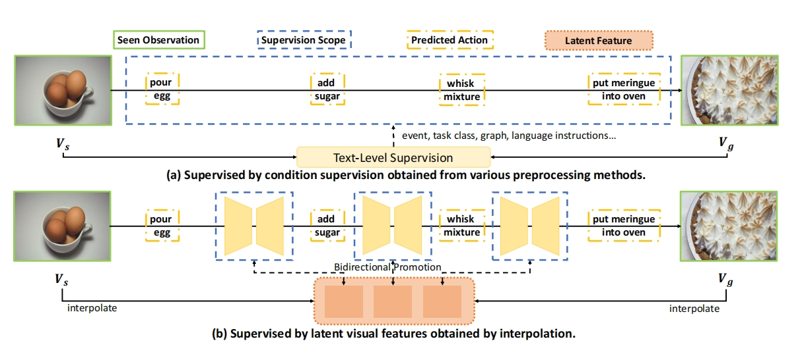

🎉 **Thrilled to share that our paper has been accepted to ICLR 2025!**

**Title:** *Masked Temporal Interpolation Diffusion for Procedure Planning in Instructional Videos*  
**Authors:** Yufan Zhou, Zhaobo Qi\*, Lingshuai Lin, Junqi Jing, Tingting Chai, Beichen Zhang, Shuhui Wang, Weigang Zhang\*  
**Affiliations:** Harbin Institute of Technology & Institute of Computing Technology, CAS  
🔗 [Code on GitHub](https://github.com/WiserZhou/MTID)

---

## Overview

This work tackles **procedure planning in instructional videos**, aiming to predict coherent action sequences based on only the **start and goal visual states**.

We introduce the **Masked Temporal Interpolation Diffusion (MTID)** model, which innovatively inserts a **learnable latent-space interpolation module** into a diffusion framework to generate intermediate visual features and improve temporal reasoning.

> 🔍 In contrast to prior works that rely on **text-level supervision**, MTID directly provides **visual-level mid-state supervision**, enabling better temporal coherence and end-to-end training.

---

## Key Contributions

- ⚙️ MTID consists of three components: a **task classifier**, a **latent-space interpolation module**, and a **DDIM-based diffusion predictor**.
- 🧩 A **learnable interpolation matrix** dynamically generates intermediate features between the observed start and goal states.
- 🎯 A **task-adaptive masked projection and proximity loss** restrict the action space and guide the model toward more accurate, goal-aligned predictions.
- 🔄 The entire model is trained **end-to-end** with task-specific objectives and strong temporal consistency.

---

---

## Acknowledgements

This work is partially supported by the National Natural Science Foundation of China and Shandong Provincial Natural Science Foundation. Special thanks to all co-authors for their contributions and to reviewers for their valuable feedback.

---

📄 *The paper will be officially published at ICLR 2025. Code is now available for the community.*

