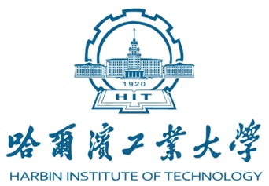

## 🎓 A New Chapter

On **August 25, 2023**, I officially graduated from my high school and embarked on a new academic journey at **Harbin Institute of Technology**, where I am currently pursuing a **Bachelor's degree in Software Engineering**.

This milestone marks not only the end of a memorable chapter but also the beginning of an exciting new one.

I would like to express my heartfelt thanks to all my high school teachers for their unwavering dedication and support throughout the years.  
In particular, I am especially grateful to my head teacher, **Yi Wang**, whose guidance and encouragement were instrumental in shaping my academic path.

---

## 🏫 School Logos

### 🎓 Harbin Institute of Technology

---

### 🏫 My High School Alma Mater

