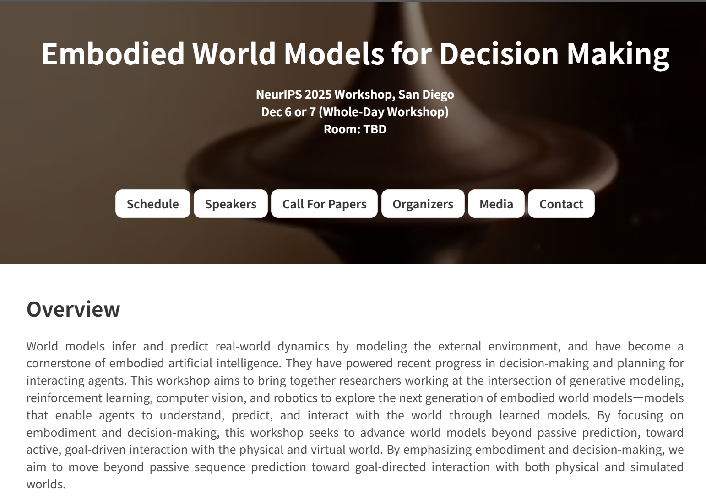

🎉 **Excited to share that I will be serving as a PC Member and Reviewer for the NeurIPS 2025 Workshop on _Embodied World Models for Decision Making_!**

This workshop explores advances in **world models** from theoretical foundations to algorithmic innovation and real-world applications within **embodied decision-making systems**.

📍 **Location**: San Diego, CA, USA  
🗓️ **Submission Deadline**: September 1st, 11:59 PM (UTC-0)  
🌐 **Website**: [embodied-world-models.github.io](https://embodied-world-models.github.io/)

We warmly welcome submissions from researchers in related fields. Please visit the [workshop website](https://embodied-world-models.github.io/) for more details!

<!-- insert image here -->

📌 *Looking forward to a productive fall with both academic collaboration and community contribution!*
