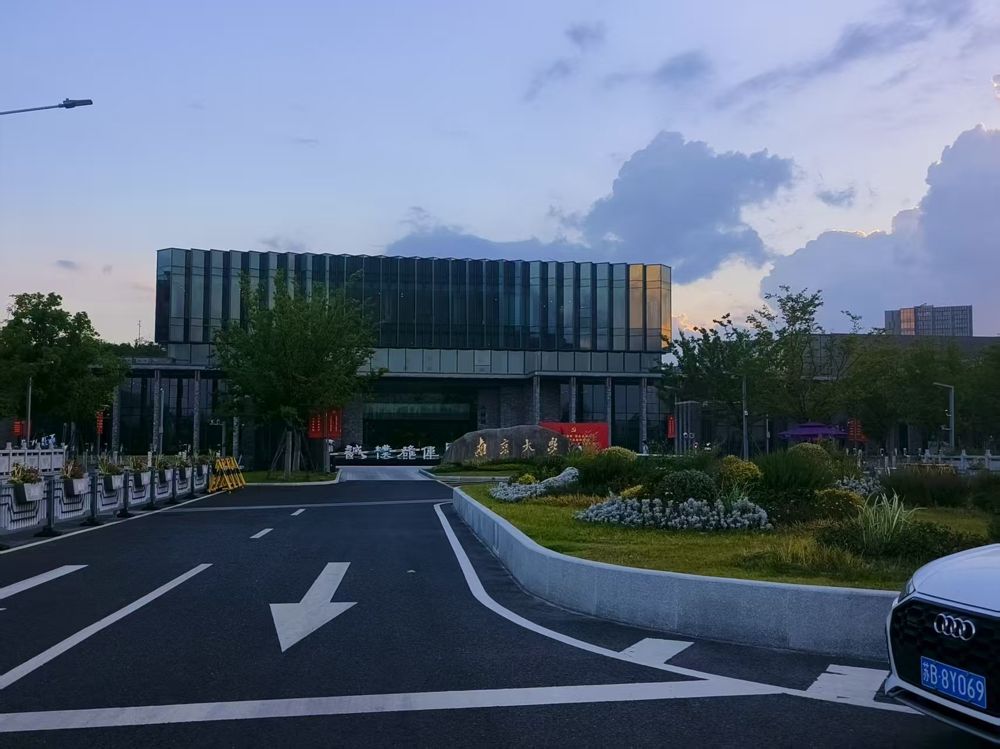
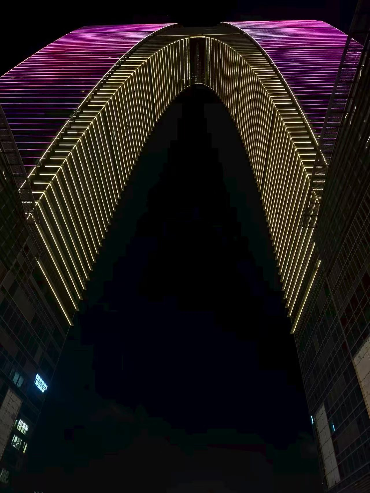

🌟 **Very excited to share that I’ve started a research visit at the Suzhou campus of Nanjing University!**

During this period, I’ll be working in the lab of [**Professor Kai Zhang**](https://cszn.github.io/), whose work in generative modeling and computer vision has long inspired me. My focus during this visiting will be on deepening my understanding of the **application of generative AI and diffusion policy** in the context of **embodied intelligence**.

🏙️ Suzhou is a beautiful and vibrant city, and I’m truly looking forward to both the academic exchange and the cultural experience this visit brings.
<figure>
  
  <figcaption><b>Figure 1:</b> Nanjing University (NJU)</figcaption>
</figure>

<figure>
  
  <figcaption><b>Figure 2:</b> The Gate of the Orient in Suzhou</figcaption>
</figure>

---

📚 *More updates to come as I delve deeper into these exciting research directions!*
